# Nemotron-Personas-Korea EDA

**캡스톤디자인 — LLM 멀티 에이전트 기반 가상 도시 마케팅 시뮬레이션**

[`nvidia/Nemotron-Personas-Korea`](https://huggingface.co/datasets/nvidia/Nemotron-Personas-Korea) 데이터셋(NVIDIA, CC-BY-4.0)에 대한 탐색적 데이터 분석(EDA)입니다. 이 데이터셋은 LLM으로 생성된 100만 명 규모의 합성 한국인 페르소나로, 가상 도시 마케팅 시뮬레이션에 투입할 에이전트 페르소나의 통계적 특성과 한계를 파악하기 위해 분석했습니다.

## 데이터셋 개요

| 항목 | 내용 |
| --- | --- |
| 행 수 | 1,000,000 |
| 컬럼 수 | 26 |
| 언어 | 한국어 |
| 라이선스 | CC-BY-4.0 |
| 결측치 | 거의 없음 (`skills_and_expertise` 등 일부 컬럼에서 1~4건 수준) |

컬럼은 크게 두 종류로 나뉩니다.

- **서술형 텍스트 (13개)**: `persona`(한줄 요약), `professional_persona`, `sports_persona`, `arts_persona`, `travel_persona`, `culinary_persona`, `family_persona`, `cultural_background`, `skills_and_expertise`(+`_list`), `hobbies_and_interests`(+`_list`), `career_goals_and_ambitions`
- **인구통계/속성 (12개)**: `sex`, `age`, `marital_status`, `military_status`, `family_type`, `housing_type`, `education_level`, `bachelors_field`, `occupation`, `district`, `province`, `country`

## 재현 방법

전체 100만 행 로드 및 분석은 로컬 환경보다 리소스가 넉넉한 **Google Colab**에서 실행하도록 노트북을 작성했습니다.

1. [`notebooks/nemotron_personas_korea_eda.ipynb`](notebooks/nemotron_personas_korea_eda.ipynb)을 Colab에 업로드
2. `런타임 > 모두 실행`
3. 마지막 셀에서 `results.zip`(그림 + 표 + 요약 통계)이 자동 다운로드됨

리소스가 부족하면 노트북 상단의 `SAMPLE_SIZE` 값을 조정해 일부 행만 샘플링할 수 있습니다.

## 폴더 구조

```
.
├── README.md
├── notebooks/
│   └── nemotron_personas_korea_eda.ipynb   # 분석 코드 (Colab 실행용)
└── results/
    ├── figures/          # 차트 (PNG)
    ├── tables/           # 집계표 (CSV)
    └── summary_stats.json
```

## 주요 분석 결과

### 1. 연령 분포

평균 50.7세(중앙값 51세, 표준편차 17.6, 19~99세 범위)로, 특정 연령대에 쏠리지 않고 20대부터 80대까지 고르게 분포합니다. 40~60대가 전체의 약 55%를 차지해 가장 두텁습니다.

| 연령대 | 인원 | 비율 |
| --- | ---: | ---: |
| 10대 | 10,491 | 1.0% |
| 20대 | 135,011 | 13.5% |
| 30대 | 149,659 | 15.0% |
| 40대 | 175,647 | 17.6% |
| 50대 | 198,750 | 19.9% |
| 60대 | 178,738 | 17.9% |
| 70대 | 96,558 | 9.7% |
| 80대 | 47,615 | 4.8% |
| 90대 | 7,531 | 0.8% |

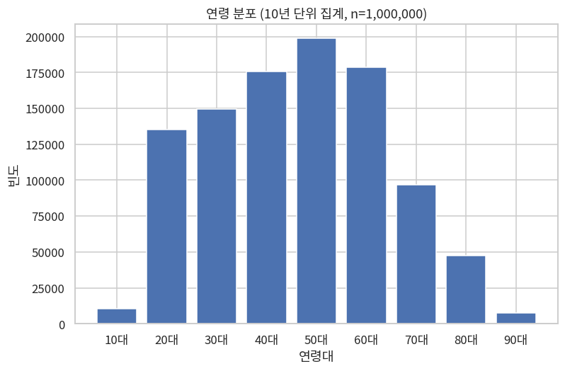
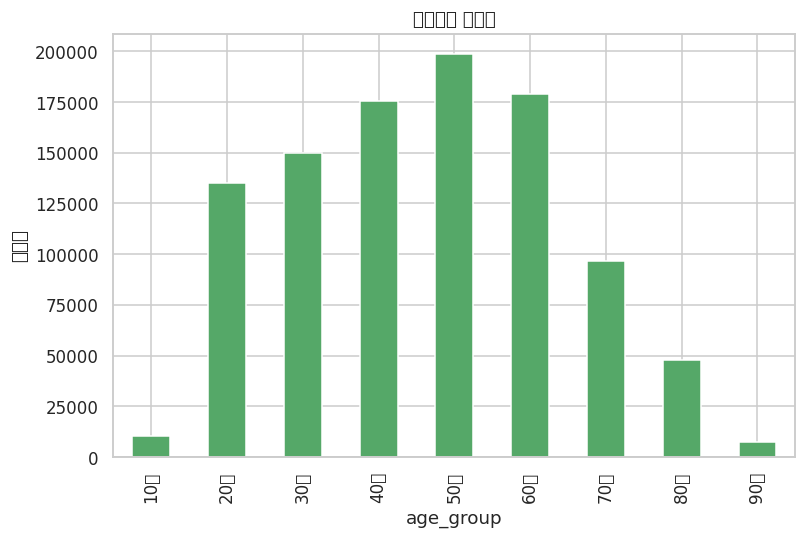

### 2. 성별 / 혼인 / 병역 / 주거 / 학력 / 전공

- **성별**: 여자 50.4% / 남자 49.6%로 거의 균등
- **혼인상태**: 배우자있음 59.3%, 미혼 25.7%, 사별 8.8%, 이혼 6.3%
- **병역**: 비현역 99.5% / 현역 0.5% — 현역 해당 연령대 비중이 작아 자연스러운 결과
- **주거형태**: 아파트 62.1%로 압도적, 단독주택 16.9%, 다세대주택 11.4%
- **학력**: 고등학교 33.1%, 4년제 대학 27.1%, 전문대 15.0%, 중학교 8.5%, 초등학교 8.1%, 대학원 5.4%, 무학 2.6%
- **전공(4년제 이상)**: 해당없음(비대졸) 67.4%를 제외하면 공학·제조·건설(6.8%)이 가장 크고, 경영·행정·법·예술·인문·보건복지 순

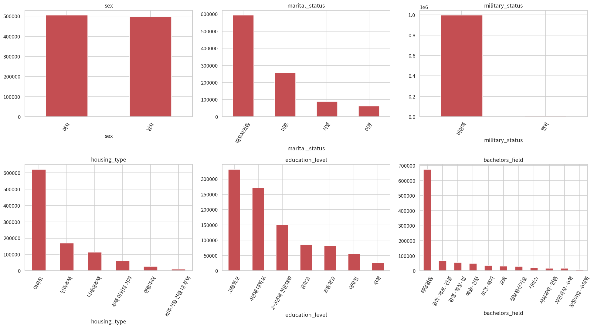

### 3. 직업 Top 20

전체의 36.7%가 `무직`으로 가장 큰 비중을 차지합니다. 취업자 중에서는 전문직보다 **청소원, 경비원, 사무보조, 전화상담원, 하역·적재 종사원** 등 서비스·단순노무직이 상위권을 형성해, 실제 한국 통계청 직업 분포와 유사한 경향을 보입니다.

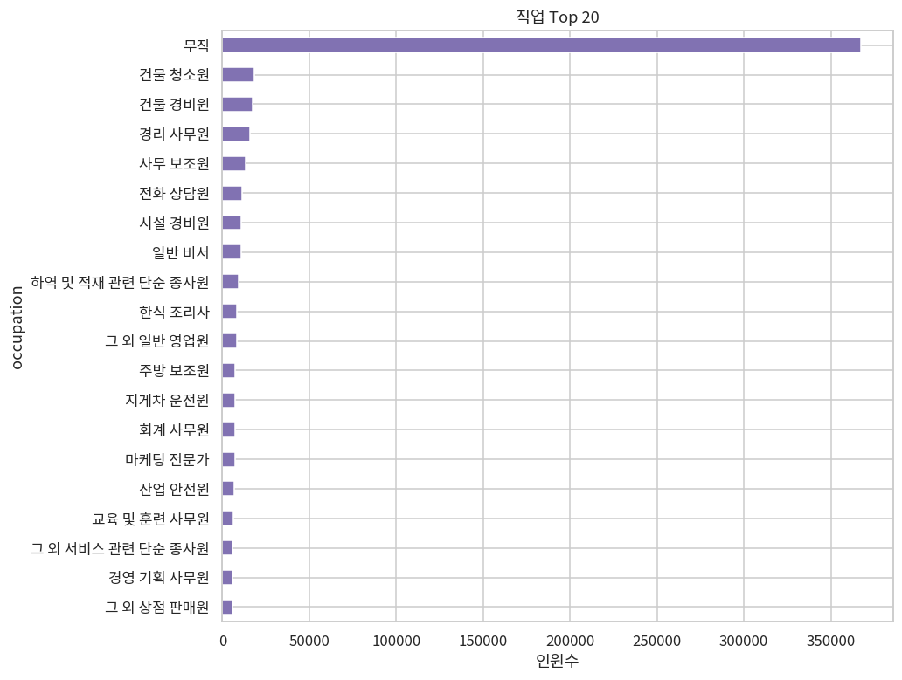

### 4. 지역 분포

경기(26.2%) > 서울(18.5%) > 부산(6.5%) 순이며, 수도권(경기+서울+인천)이 전체의 **약 50.6%**를 차지해 실제 한국의 수도권 인구 집중 현상과 방향이 일치합니다.

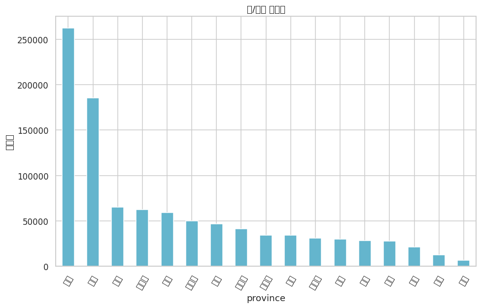
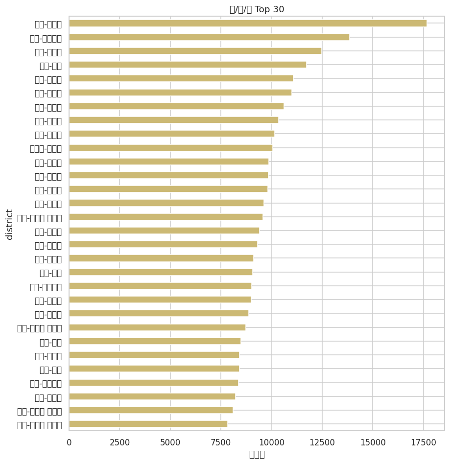

### 5. 교차분석

- **연령대 × 학력**: 고령층일수록 저학력(초·중졸) 비중이 뚜렷이 높아지고, 청장년층은 대졸 이상 비중이 높음 — 실제 한국의 세대별 교육수준 변화를 반영
- **성별 × 혼인상태**: `사별` 비중이 여자에서 남자보다 뚜렷이 높음 — 여성의 평균 기대수명이 더 긴 현실과 일치
- **연령대 × 주거형태**: 전 연령대에서 아파트가 우세하나, 고령층에서 단독주택·다세대주택 비중이 상대적으로 증가

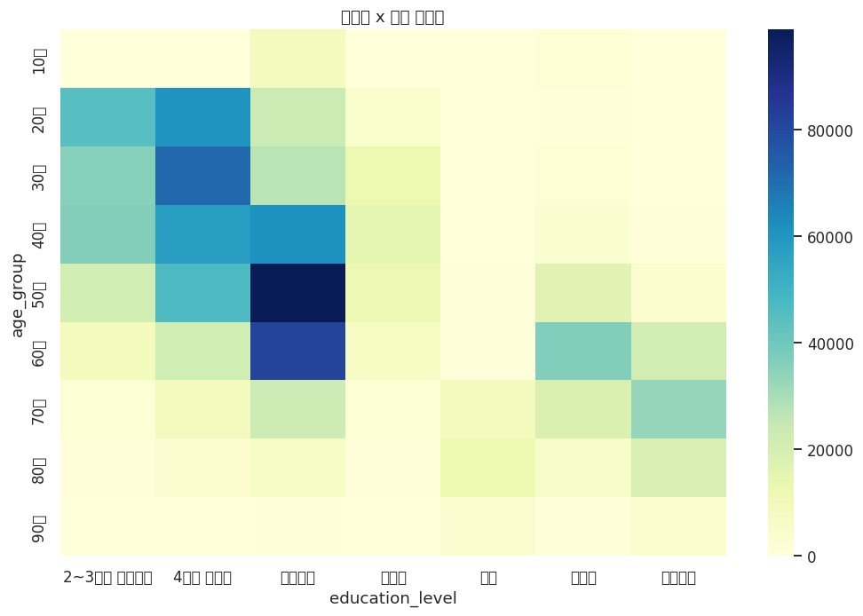
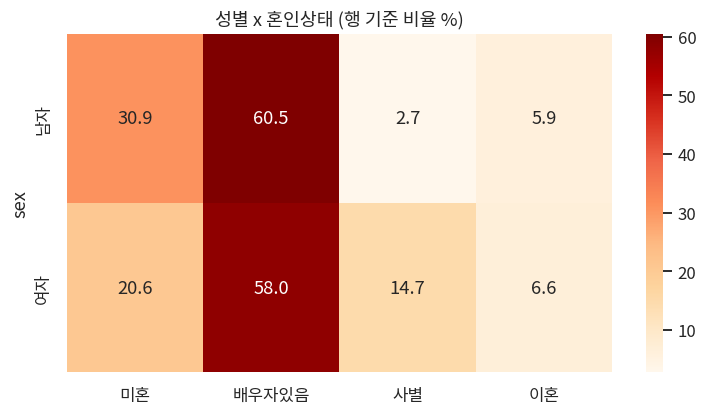
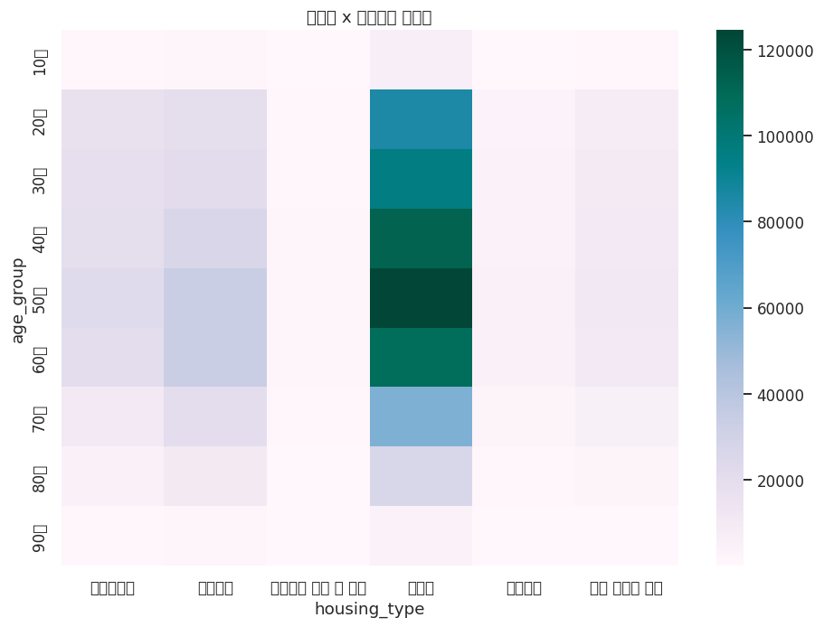

### 6. 페르소나 텍스트 길이

| 필드 | 평균 글자수 | 범위 |
| --- | ---: | --- |
| `persona` (한줄 요약) | 81.5 | 42~174 |
| `professional_persona` | 159.5 | 60~306 |
| `family_persona` | 144.0 | 58~252 |
| `culinary_persona` | 142.0 | 59~277 |
| `arts_persona` | 138.2 | 54~260 |
| `cultural_background` | 135.3 | 55~299 |
| `travel_persona` | 135.1 | 51~248 |
| `sports_persona` | 133.7 | 51~293 |
| `hobbies_and_interests` | 128.9 | 6~305 |
| `skills_and_expertise` | 121.0 | 50~247 |
| `career_goals_and_ambitions` | 118.3 | 47~243 |

`persona`는 요약용 한 줄 소개, 나머지 항목은 100~160자 내외의 문단형 서술로 일관된 길이 분포를 보입니다.

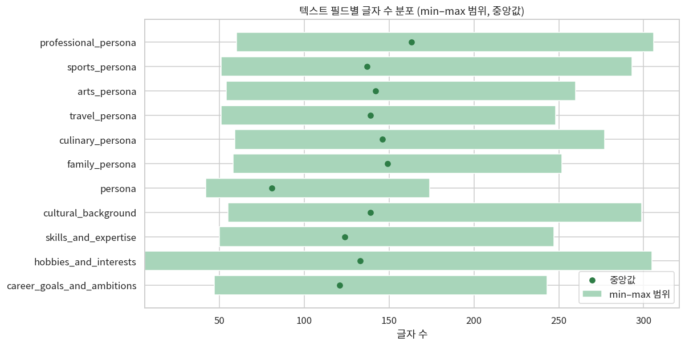

### 7. 취미·역량 키워드 Top 25

가장 빈번한 취미는 `지역 배드민턴 동호회 활동`, `임영웅 노래 감상`, `유튜브 트로트 영상 시청`, `베란다 텃밭 가꾸기` 순이며, 역량 키워드는 `제철 나물 무침`, `효율적인 가계 지출 관리`, `베란다 텃밭 작물 재배` 순입니다.

주목할 점은 **`동네 배드민턴 클럽 활동` / `지역 배드민턴 클럽 활동` / `지역 배드민턴 동호회 활동`**처럼 같은 의미를 가리키는 문구가 여러 변형으로 흩어져 집계된다는 것입니다. 즉 이 필드는 정규화되지 않은 자유 텍스트에 가까워, 마케팅 시뮬레이션에서 태그나 세그먼트로 활용하려면 별도의 클러스터링·정규화 전처리가 필요합니다.

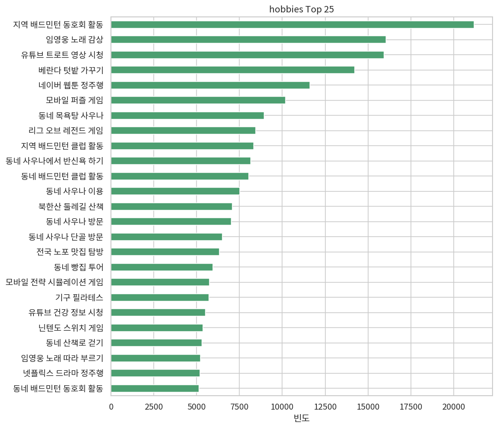
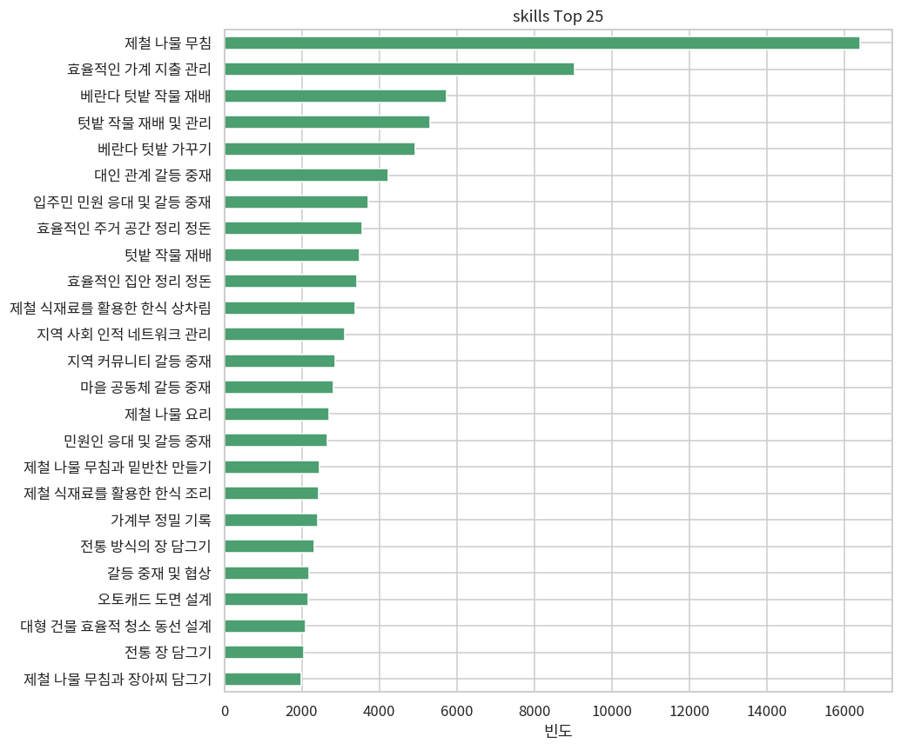

### 8. 범주형 변수 간 연관성 (Cramér's V)

| 변수 쌍 | Cramér's V | 해석 |
| --- | ---: | --- |
| 연령대 × 혼인상태 | 0.489 | 가장 강한 연관 — 예상대로 |
| 연령대 × 학력 | 0.338 | 세대별 교육수준 차이 반영 |
| 학력 × 혼인상태 | 0.288 | 중간 수준 연관 |
| 성별 × 혼인상태 | 0.227 | 사별 비중의 성별 차이 반영 |
| 주거형태 × 지역 | 0.176 | 지역별 주거유형 차이 |
| 주거형태 × 성별 / 병역 | 0.005 / 0.006 | 사실상 무관 |

전반적으로 **연령대**가 혼인상태·학력과 가장 강하게 얽혀 있고, 성별·병역·주거형태·지역은 서로 비교적 독립적입니다.

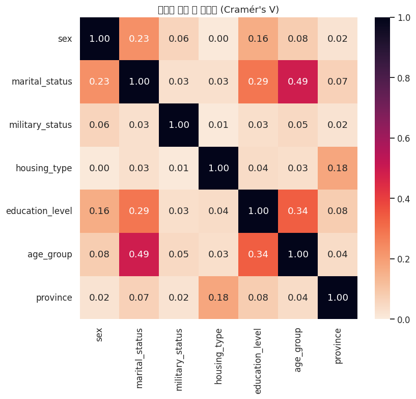

## 시사점 및 한계

- 지역·연령·학력 분포가 실제 한국 인구 통계의 큰 흐름(수도권 집중, 세대별 학력 격차, 여성 사별 비율 등)을 어느 정도 반영하고 있어, 가상 도시 마케팅 시뮬레이션의 에이전트 배경으로 활용하기에 무리가 없어 보입니다.
- 다만 `occupation`은 `무직` 비중이 지나치게 높고(36.7%), `hobbies_and_interests_list` / `skills_and_expertise_list`는 표현이 정규화되어 있지 않아 그대로 세그먼트 태그로 쓰기엔 전처리(동의어 병합, 클러스터링)가 필요합니다.
- 본 분석은 전체 100만 행을 대상으로 했으나, Colab 실행 시 `SAMPLE_SIZE`를 줄이면 결과가 다소 달라질 수 있습니다 (다만 표본 크기가 워낙 커서 인구통계 비율 자체는 안정적으로 유지됩니다).

## 최애 주민

100만 명 중 직접 뽑은 가상 도시 주민도 소개합니다 → [인상훈 씨 (24세, 수원 권선구, 육군 병사)](residents/인상훈.md)

## 출처

- 데이터셋: [nvidia/Nemotron-Personas-Korea](https://huggingface.co/datasets/nvidia/Nemotron-Personas-Korea) (CC-BY-4.0)
